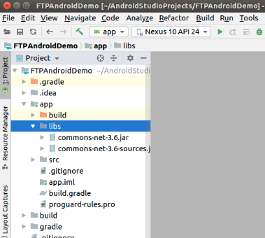
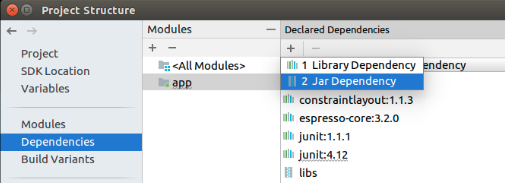
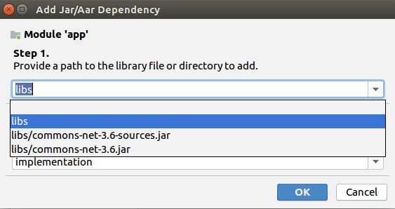
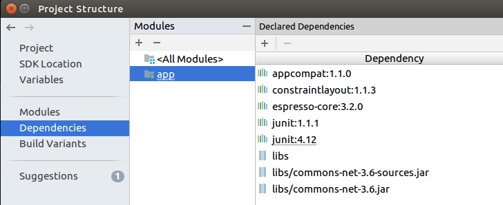

# ftp-android
Sending files via ftp on Android.

# Required Files

This project require to add the Apache Commons Net library to implement the client side of many basic Internet protocols. The llibrary supports the File Transfer Protocol which is the main protocol used for this project.

We visit the Apache Commons Net site to download the used .jar files at: 
http://commons.apache.org/proper/commons-net/download_net.cgi

From them we required the: <b>commons-net-3.6.jar</b> and <b>commons-net-3.6-sources.jar</b> packages.

To add the required jars to the project follow the next steps:

On the Project tab, open the spinner and select the Project mode view.

Copy and paste the downloaded jars into the libs folder

Select the File > Project Structure from the main menu.

Under the Dependencies > All Dependencies tab, click on the + button. Select Jar Dependency. 

Then on the Step 1 select one of the downloaded jars you've just added. Click OK and repeat the processs for the second jar.

Finally, you'll be able to see the added libs in the Dependency window,

# Camera API

We make use of the old camera API to support a Surface View and the Picture Callback interface to automatically take pictures qith no user interaction

# Required Permissions

Because this App makes use of the Camera and Internal Storage, we required to give these permissions to the Manifest File.

This App, requires the next permissions:

    <uses-permission android:name="android.permission.INTERNET" />
    <uses-permission android:name="android.permission.ACCESS_NETWORK_STATE" />
    <uses-permission android:name="android.permission.WRITE_EXTERNAL_STORAGE" />
    <uses-permission android:name="android.permission.READ_EXTERNAL_STORAGE" />
    <uses-permission android:name="android.permission.GET_ACCOUNTS" />
    <uses-permission android:name="android.permission.WAKE_LOCK" />

