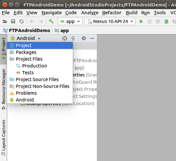

# ftp-android
Sending files via ftp on Android.

# Required Files

This project require to add the Apache Commons Net library to implement the client side of many basic Internet protocols. The llibrary supports the File Transfer Protocol which is the main protocol used for this project.

We visit the Apache Commons Net site to download the used .jar files at: 
http://commons.apache.org/proper/commons-net/download_net.cgi

From them we required the: <b>commons-net-3.6.jar</b> and <b>commons-net-3.6-sources.jar</b> packages.

To add the required jars to the project follow the next steps:

# Camera API

We make use of the old camera API to support a Surface View and the Picture Callback interface to automatically take pictures qith no user interaction

